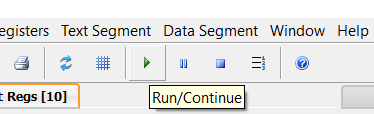

# Computer Architecture

Codes for the course. <br>
Not required by the instructor, so this is purely for practice.

## Set Up

### Windows (GUI)

- Download and install PCSPIM from <a href="https://sourceforge.net/projects/spimsimulator/files/latest/download">here</a>
- Use `File -> Load File` or `File -> Reinitialize and Load File` to open MIPS code
- Run the code from here: <br> 

### Linux / WSL (CLI)

- Install spim: `sudo apt install spim`
- To run, either use `spim -f <path to file>`
- Or you can:
  - Type `spim` for interactive shell
  - Use `load "<path to file>"` (in double quotes)
  - Type `run`
  - Use `print` to inspect register values
    - e.g. `print $s0`
  - And `exit` to quit

## Basic Structure

```mips
.data
example: .word 1,2,3,4

.text
main:
  # <your code>

  li $v0, 10
  syscall
```

### `.data`

Define your variables here. <br>
The code above defines an array of words (4-byte or 32-bits) named `example`, initialized with the first 4 natural numbers.

### `.text`

Your code goes here. <br>
`li` and `syscall` are used to call `exit` to prevent any crashes from executing any code after that.

## Commands Reference


<table>
  <thead>
    <tr>
      <th>Name</th>
      <th>Syntax</th>
      <th>Format</th>
      <th>Op, Funct (if applicable)</th>
    </tr>
  </thead>
  <tbody>
      <tr>
        <td>add</td>
        <td>add reg, reg, reg</td>
        <td>add rd, rs, rt</td>
        <td>0, 32</td>
      </tr>
      <tr>
        <td>sub</td>
        <td>sub reg, reg, reg</td>
        <td>sub rd, rs, rt</td>
        <td>0, 34</td>
      </tr>
      <tr>
        <td>add-immediate</td>
        <td>addi reg, reg, constant</td>
        <td>addi rd, rs, immediate</td>
        <td>8</td>
      </tr>
      <tr>
        <td>load word</td>
        <td>lw reg, offset(reg)</td>
        <td>lw rt, immediate(rs)</td>
        <td>35</td>
      </tr>
      <tr>
        <td>store word</td>
        <td>sw reg, offset(reg)</td>
        <td>sw rt, immediate(rs)</td>
        <td>43</td>
      </tr>
      <tr>
        <td>shift left logical</td>
        <td>sll reg, reg, const</td>
        <td>sll rd, rt, shamt</td>
        <td>0, 0</td>
      </tr>
      <tr>
        <td>shift right logical</td>
        <td>srl reg, reg, const</td>
        <td>srl rd, rt, shamt</td>
        <td>0, 2</td>
      </tr>
      <tr>
        <td>branch on equal</td>
        <td>beq reg, reg, label</td>
        <td>beq rs, rt, address</td>
        <td>4</td>
      </tr>
      <tr>
        <td>branch on not equal</td>
        <td>bne reg, reg, label</td>
        <td>bne rs, rt, address</td>
        <td>5</td>
      </tr>
      <tr>
        <td>branch on less than</td>
        <td>blt reg, reg, label</td>
        <td>Pseudo-instruction</td>
        <td>Pseudo-instruction</td>
      </tr>
      <tr>
        <td>branch on less than or equal</td>
        <td>ble reg, reg, label</td>
        <td>Pseudo-instruction</td>
        <td>Pseudo-instruction</td>
      </tr>
      <tr>
        <td>branch on greater than</td>
        <td>bgt reg, reg, label</td>
        <td>Pseudo-instruction</td>
        <td>Pseudo-instruction</td>
      </tr>
      <tr>
        <td>branch on greater than or equal</td>
        <td>bge reg, reg, label</td>
        <td>Pseudo-instruction</td>
        <td>Pseudo-instruction</td>
      </tr>
      <tr>
        <td>set on less than</td>
        <td>slt reg, reg, reg</td>
        <td>slt rd, rs, rt</td>
        <td>0, 42</td>
      </tr>
      <tr>
        <td>set on less than immediate</td>
        <td>slti reg, reg, const</td>
        <td>slti rd, rs, immediate</td>
        <td>10</td>
      </tr>
      <tr>
        <td>unconditional jump</td>
        <td>j label</td>
        <td>j address</td>
        <td>2</td>
      </tr>
      <tr>
        <td>and</td>
        <td>and reg, reg, reg</td>
        <td>and rd, rs, rt</td>
        <td>0, 36</td>
      </tr>
      <tr>
        <td>or</td>
        <td>or reg, reg, reg</td>
        <td>or rd, rs, rt</td>
        <td>0, 37</td>
      </tr>
      <tr>
        <td>nor</td>
        <td>nor reg, reg, reg</td>
        <td>nor rd, rs, rt</td>
        <td>0, 39</td>
      </tr>
  </tbody>
</table>
